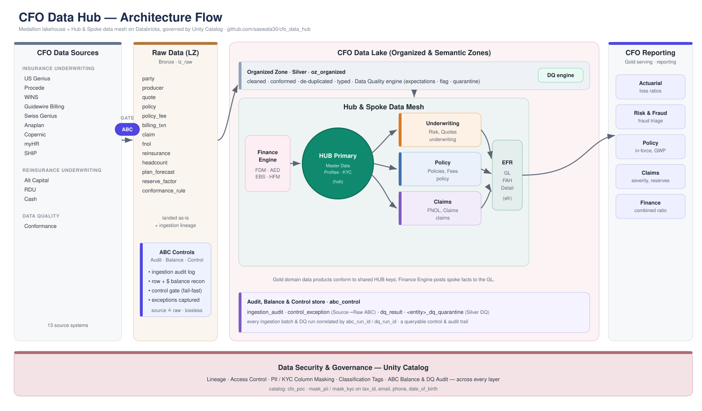
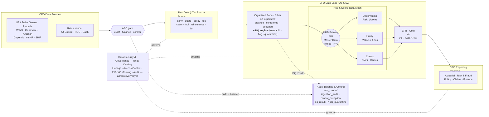

# CFO Data Platform — PoC

A runnable proof-of-concept of the **CFO Data Architecture** on Databricks: a medallion
lakehouse with a **Hub & Spoke data mesh**, an **Enterprise Finance Reporting (EFR)**
gold layer, CFO reporting marts, and **Unity Catalog** governance spanning every layer.

It ships with a synthetic commercial P&C / specialty / reinsurance dataset (AXA XL-style)
so the whole thing runs end-to-end in any Databricks workspace with no external data.

Source → Raw ingestion is wrapped by an **Audit, Balance & Control (ABC)** framework, and
the Silver layer runs a declarative **Data Quality (DQ)** engine — deterministic rules **plus
AI-Function checks** (Databricks `ai_query`) for semantic/contextual quality — both writing a
queryable control/audit trail to the `abc_control` schema.

> Sources → ⟨**ABC** gate⟩ → Raw (LZ / Bronze) → Organized Zone (Silver **+ DQ**) → Hub & Spoke + EFR (Gold) → CFO Reporting — governed by Unity Catalog.

## Architecture



<details>
<summary>Text (Mermaid) version</summary>



</details>

Each box maps to code:

| Architecture element | Unity Catalog schema | Notebook |
|---|---|---|
| CFO Data Sources (synthetic extracts) | `lz_raw.landing` (Volume) | `01_generate_synthetic_sources` |
| Raw Data (LZ) — Bronze **+ ABC controls** | `lz_raw` | `02_landing_zone_bronze` (+ `_abc`) |
| Organized Zone — Silver **+ DQ (rules + AI)** | `oz_organized` (+ `*_dq_quarantine`, `*_dq_ai_flagged`) | `03_organized_zone_silver` (+ `_dq`, `_dq_ai`) |
| HUB Primary (Master Data, KYC) | `hub` | `04_hub_master_data` |
| Spoke — Underwriting (Risk, Quotes) | `underwriting` | `05_spoke_underwriting` |
| Spoke — Policy (Policies, Fees) | `policy` | `06_spoke_policy` |
| Spoke — Claims (FNOL, Claims) | `claims` | `07_spoke_claims` |
| EFR — Finance Engine (GL, FAH) | `efr` | `08_efr_semantic_gold` |
| CFO Reporting marts | `reporting` | `09_reporting_marts` |
| Audit, Balance & Control + DQ results | `abc_control` | `_abc`, `_dq` (invoked by `02` / `03`) |
| Data Security & Governance | *(all schemas)* | `00_setup_unity_catalog`, `10_governance_masking` |

## What the pipeline builds

- **13 source-system extracts** landed to a Volume (parties+KYC, quotes, policies, fees,
  billing, claims, FNOL, reinsurance treaties, headcount, plan, actuarial factors, DQ rules).
- **Bronze** raw Delta tables with ingestion lineage; **Silver** conformed/deduped entities.
- **Audit, Balance & Control (ABC)** on Source → Raw: every entity's landed source is
  reconciled against the raw target on **row count** and a **numeric control total**
  (e.g. `SUM(gross_written_premium)` in = out); results append to
  `abc_control.ingestion_audit`, breaches to `abc_control.control_exception`, and a
  **control gate fails the run** on a hard breach (nothing landed / row-count imbalance).
- **Silver Data Quality (DQ)**: a declarative expectation set per entity (not-null, range,
  allowed-set, regex, **referential integrity** — e.g. every `claim.policy_id` must resolve
  to a policy). Rows are flagged, HIGH-severity failures routed to `<entity>_dq_quarantine`,
  and per-rule pass/fail metrics logged to `abc_control.dq_result`.
- **AI-powered DQ** (Databricks **AI Functions**, `ai_query` with structured output) for the
  semantic checks rules can't express: is a `party.legal_name` a real entity vs. gibberish;
  is a claim's `cause_of_loss` plausible for its `line_of_business`; does an FNOL
  `description` match the coded cause. **Advisory** (flag + log, never quarantine),
  **sampled** and **non-fatal**; results in `abc_control.dq_ai_result`, flagged rows in
  `<entity>_dq_ai_flagged`. Toggle/tune in `src/_common.py` (`AI_DQ_ENABLED`,
  `AI_DQ_MODEL`, `AI_DQ_SAMPLE_ROWS`) — the effective values; `conf/config.yml`
  mirrors them under `controls.ai_dq` for documentation.
- **HUB Primary**: `dim_party`, `dim_producer`, `party_kyc_profile` — the golden keys
  every spoke conforms to.
- **Three domain spokes** publishing data products: Underwriting (`fact_quote`,
  `risk_appetite_summary`), Policy (`fact_policy`, `premium_summary`), Claims
  (`fact_claim`, `fraud_triage`).
- **EFR gold**: a general ledger (`gl_detail`), `trial_balance`, and `reinsurance_ceded`
  posted by a Finance Engine step.
- **CFO Reporting views**: `actuarial_reporting`, `risk_fraud_reporting`,
  `policy_reporting`, `claims_reporting`, `finance_reporting` (loss / expense / combined ratios).
- **Governance**: column masks on PII (`tax_id`, `email`, `phone`, `date_of_birth`) and KYC,
  `pii`/`kyc` classification tags, and access grants.

## Run it

Prereqs: a Unity Catalog-enabled Databricks workspace, the [Databricks CLI](https://docs.databricks.com/dev-tools/cli/) (≥ v0.240), and permission to create a catalog. Serverless workflows must be enabled (tasks run on serverless jobs compute).

```bash
# 1. Authenticate
databricks configure                      # or set DATABRICKS_HOST / DATABRICKS_TOKEN

# 2. Point the bundle at your workspace: edit workspace.host in databricks.yml

# 3. Deploy + run the whole pipeline
databricks bundle deploy -t dev
databricks bundle run cfo_data_platform_pipeline -t dev
```

Or run the notebooks in `src/` in order (`00` → `10`) in a notebook, passing the
`catalog` widget. Adjust data volume in `conf/config.yml` (`scale`).

Try the results:

```sql
SELECT * FROM cfo_poc.reporting.finance_reporting  ORDER BY combined_ratio DESC;
SELECT * FROM cfo_poc.reporting.actuarial_reporting ORDER BY loss_ratio DESC;
SELECT * FROM cfo_poc.claims.fraud_triage WHERE triage_priority = 'P1';
-- PII masking in action (masked unless you're in cfo_pii_readers):
SELECT party_id, legal_name, tax_id, email, date_of_birth FROM cfo_poc.hub.dim_party LIMIT 5;

-- ABC: Source -> Raw audit & balance trail (one row per entity per run)
SELECT entity, source_row_count, target_row_count, row_variance,
       control_column, control_total_variance, rows_balanced, status
FROM   cfo_poc.abc_control.ingestion_audit
ORDER  BY abc_run_id DESC, entity;

-- ABC: any control breaches raised
SELECT * FROM cfo_poc.abc_control.control_exception ORDER BY detected_at DESC;

-- Silver DQ: per-rule pass/fail for the latest run
SELECT entity, rule_id, rule_type, severity, rows_evaluated, rows_failed, fail_rate, passed
FROM   cfo_poc.abc_control.dq_result
WHERE  dq_run_id = (SELECT MAX(dq_run_id) FROM cfo_poc.abc_control.dq_result)
ORDER  BY passed, severity, entity;

-- AI DQ: semantic checks via Databricks AI Functions (advisory)
SELECT entity, check_name, check_type, model, rows_evaluated, rows_flagged, flag_rate
FROM   cfo_poc.abc_control.dq_ai_result
ORDER  BY dq_run_id DESC, flag_rate DESC;
-- inspect the rows the model flagged, e.g. implausible claims:
SELECT * FROM cfo_poc.oz_organized.claim_dq_ai_flagged LIMIT 20;
```

## Layout

```
saswata30/
├── databricks.yml                 # Asset Bundle: serverless job, 11 chained tasks
├── conf/config.yml                # catalog, schemas, data scale, governance groups
├── src/
│   ├── _common.py                 # shared config + helpers (%run-included)
│   ├── _abc.py                    # Audit, Balance & Control framework (%run-included by 02)
│   ├── _dq.py                     # Silver Data Quality engine — rules (%run-included by 03)
│   ├── _dq_ai.py                  # Silver Data Quality — AI Functions (%run-included by 03)
│   ├── 00_setup_unity_catalog.py  # catalog / schemas / volume (incl. abc_control)
│   ├── 01_generate_synthetic_sources.py
│   ├── 02_landing_zone_bronze.py  # Bronze ingest + ABC audit/balance/control gate
│   ├── 03_organized_zone_silver.py # Silver conform + DQ expectations/quarantine
│   ├── 04_hub_master_data.py
│   ├── 05_spoke_underwriting.py
│   ├── 06_spoke_policy.py
│   ├── 07_spoke_claims.py
│   ├── 08_efr_semantic_gold.py
│   ├── 09_reporting_marts.py
│   └── 10_governance_masking.py
└── docs/architecture.md           # deeper design: data model, lineage, mesh rationale
```

See [`docs/architecture.md`](docs/architecture.md) for the data model and design notes.

---
*Proof of concept — synthetic data only, not for production use.*
