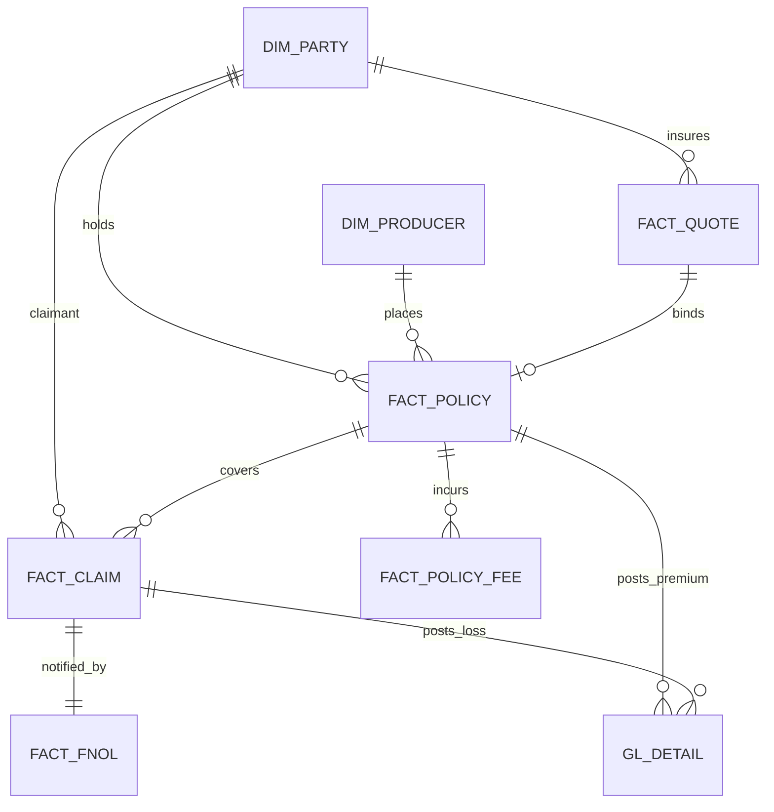

# Architecture & Design Notes

## Design intent

This PoC realises the CFO Data Architecture as a **governed medallion lakehouse with a
hub-and-spoke data mesh**. The medallion (Bronze → Silver → Gold) provides the refinement
pipeline; the mesh provides **domain ownership** — Underwriting, Policy and Claims each own
a curated data product that conforms to shared master data published by the HUB. Finance
consumes all three through the EFR general ledger, and Unity Catalog governs the lot.

### Why hub-and-spoke (not one monolithic warehouse)

- **Conformed keys, distributed ownership.** The HUB publishes `dim_party` / `dim_producer`
  once; every spoke joins to those keys, so premium, losses and exposure reconcile across
  domains without a central team modelling everything.
- **Independent evolution.** A spoke can add tables or change cadence without breaking others,
  as long as it keeps conforming to the hub keys — the data-mesh contract.
- **Blast-radius control.** KYC / PII lives in the HUB and is masked there; spokes reference
  keys, not raw identifiers.

## Zones

| Zone | Schema | Role | Materialisation |
|---|---|---|---|
| Landing (Bronze) | `lz_raw` | Raw, as-landed, immutable + ingestion lineage | Delta tables |
| Organized (Silver) | `oz_organized` | Typed, deduped, conformed, DQ-flagged | Delta tables |
| HUB Primary | `hub` | Golden master data + KYC | Delta tables |
| Spokes | `underwriting`, `policy`, `claims` | Domain data products (facts + summaries) | Delta tables |
| EFR (Gold) | `efr` | General ledger, trial balance, reinsurance | Delta tables |
| Reporting (Gold serving) | `reporting` | CFO reporting marts | Views |
| Audit, Balance & Control | `abc_control` | Ingestion audit/balance trail + Silver DQ results | Delta tables |

## Audit, Balance & Control (ABC) — Source → Raw

`02_landing_zone_bronze` wraps every entity's ingestion with the ABC framework
(`src/_abc.py`). The contract for the Bronze layer is that ingestion is **lossless** —
what lands from the source systems must arrive in `lz_raw` unchanged — so ABC verifies
exactly that, per entity, per run.

- **Audit** — an append-only row is written to `abc_control.ingestion_audit` for every
  `(abc_run_id, entity)`: the source systems and landing paths, landed **file count**,
  **source vs. target row counts**, the numeric **control totals**, timings, and a status
  (`SUCCESS` / `WARN` / `FAILED`). `abc_run_id` is the ingestion batch id (`_bronze_batch`),
  so audit rows join back to the exact Bronze rows they describe.
- **Balance** — two reconciliations of *landed source* against *raw target*:
  - **Row-count balance** — `source_row_count == target_row_count` (hard control).
  - **Control-total balance** — a per-entity numeric measure summed on both sides must
    match within `controls.control_total_tolerance` (default exact), e.g.
    `SUM(gross_written_premium)` for `policy`, `SUM(amount)` for `policy_fee` /
    `billing_transaction`, `SUM(incurred_amount)` for `claim`. Entities with no natural
    measure balance on row count only.

  | Entity | Control-total column | Entity | Control-total column |
  |---|---|---|---|
  | policy | `gross_written_premium` | claim | `incurred_amount` |
  | policy_fee | `amount` | reinsurance_contract | `ceded_premium` |
  | billing_transaction | `amount` | headcount | `annual_cost` |
  | quote | `premium_quoted` | plan_forecast | `planned_amount` |
  | producer | `commission_rate` | party / fnol / reserve_factor / conformance_rule | *(row count only)* |

- **Control** — every breach is logged to `abc_control.control_exception`
  (`EMPTY_INGESTION`, `ROW_COUNT_BALANCE` = HIGH; `CONTROL_TOTAL_BALANCE` = MEDIUM), and a
  **control gate** (`abc_gate`) raises on any HIGH breach — failing the `landing_zone_bronze`
  task so the run stops before bad raw data reaches Silver.

## Silver Data Quality (DQ)

`03_organized_zone_silver` conforms the raw entities and then runs the declarative DQ
engine (`src/_dq.py`) over each conformed DataFrame. Expectations are small composable
specs — `dq_not_null`, `dq_range`, `dq_in_set`, `dq_regex`, `dq_referential` — and rule
ids reuse the `conformance_rule` catalogue where they align (e.g. `CR001` GWP > 0,
`CR002` tax_id required, `CR003` claim → policy referential, `CR005` risk_score 1–100).

For each entity the engine, in a single pass:

1. flags every row with `_dq_status` (PASS / FAIL) and `_dq_failed_rules`;
2. routes rows failing a **HIGH**-severity rule to `oz_organized.<entity>_dq_quarantine`
   (kept out of the clean conformed table when `controls.quarantine_dq_failures` is true),
   so the Hub and Spokes only ever build on rows that passed;
3. appends one result row per rule to `abc_control.dq_result`
   (`rows_evaluated`, `rows_failed`, `fail_rate`, `passed`), correlated by `dq_run_id`.

Severity drives routing: HIGH failures are quarantined; MEDIUM failures (e.g. an email
regex miss) are flagged and recorded but stay in the conformed table. This keeps the
medallion contract — Silver is *trusted* — while preserving a complete DQ audit trail.

### AI-powered DQ (Databricks AI Functions)

Deterministic rules cover *structural* quality (types, ranges, keys, referential
integrity) exactly and for free. `src/_dq_ai.py` adds a second layer for *semantic /
contextual* quality that rules cannot express, using **Databricks AI Functions**
(`ai_query` with a `STRUCT<...>` `responseFormat` for typed, endpoint-agnostic verdicts):

| Check | Entity | Columns | Verdict |
|---|---|---|---|
| Legal-name validity | `party` | `legal_name` | plausible real entity vs. test/placeholder/gibberish |
| Cause ↔ line-of-business plausibility | `claim` | `cause_of_loss`, `line_of_business` | consistent pairing for a P&C / specialty insurer |
| Description ↔ cause consistency | `fnol` | `description`, `cause_of_loss` | free-text matches the coded cause |

Design guarantees, because LLM verdicts are probabilistic and metered:

- **Advisory, not gating** — flagged rows are logged to `abc_control.dq_ai_result` and
  copied to `oz_organized.<entity>_dq_ai_flagged`, but are **never quarantined**. Only the
  deterministic HIGH-severity rules remove rows from Silver.
- **Sampled** — each check scores at most `controls.ai_dq.sample_rows` rows (default 200),
  so cost is bounded regardless of table size.
- **Non-fatal** — the whole AI pass is wrapped so any AI Function / endpoint / permission
  error is caught and logged; the pipeline continues.
- **Configurable** — `AI_DQ_ENABLED` in `src/_common.py` toggles it (the effective value;
  `controls.ai_dq.enabled` in `conf/config.yml` mirrors it for documentation, as with the
  rest of the config); `AI_DQ_MODEL` points at any Serving / Foundation Model endpoint (e.g.
  `databricks-meta-llama-3-3-70b-instruct`, or a cheaper `system.ai.gpt-oss-20b`). The
  task-specific functions `ai_classify`, `ai_mask` and `ai_similarity` are drop-in
  alternatives for these checks.

Requires Foundation Model API access and a DBR / serverless SQL that supports AI Functions.

## Data model (key entities)

**HUB** — `dim_party` (party master + KYC rating), `dim_producer` (broker/MGA),
`party_kyc_profile` (KYC status, sanctions, PEP).
**Underwriting** — `fact_quote` (risk score, tech price, price adequacy, hit indicator),
`risk_appetite_summary`.
**Policy** — `fact_policy` (GWP, net premium, in-force), `fact_policy_fee`, `premium_summary`.
**Claims** — `fact_claim` (incurred/paid/reserve, fraud score, severity band),
`fraud_triage`.
**EFR** — `gl_detail` (posting lines), `trial_balance`, `reinsurance_ceded`.

## Finance Engine → GL posting rules

`08_efr_semantic_gold` posts spoke facts into a general ledger (the FDM/AED/EBS/HFM
"Finance Engine"):

| Economic event | Source | Account | Category |
|---|---|---|---|
| Gross written premium | `policy.fact_policy` | 4000 Gross Written Premium | REVENUE |
| Broker commission | `policy.fact_policy_fee` | 6100 Broker Commission | EXPENSE |
| Taxes & fees | `policy.fact_policy_fee` | 6200 Taxes & Fees | EXPENSE |
| Losses paid | `claims.fact_claim` | 5000 Losses Paid | LOSS |
| Loss reserves | `claims.fact_claim` | 5100 Loss Reserves | RESERVE |

`finance_reporting` then derives **loss ratio**, **expense ratio** and **combined ratio**
per LOB / region / period from the trial balance.

## Governance (Unity Catalog, every layer)

- **PII masking** — `mask_pii` / `mask_pii_date` on `dim_party.{tax_id,email,phone,date_of_birth}`;
  unmasked only for `cfo_pii_readers`.
- **KYC masking** — `mask_kyc` on `party_kyc_profile.tax_id`; unmasked only for `cfo_kyc_readers`.
- **Classification tags** — `pii=true` / `kyc=true` on sensitive columns for discovery & audit.
- **Access grants** — reporting readable by `account users`; hub restricted to reader groups.
- **Lineage** — captured automatically by Unity Catalog across the notebook DAG; the bronze
  layer also stamps `_source_file`, `_ingested_at`, `_bronze_batch`.

## Extending the PoC

- Swap synthetic generation (`01`) for **Lakeflow Connect** / Auto Loader on the real
  Genius / Guidewire / Anaplan extracts — the Volume landing pattern is already in place.
  ABC row/control-total balance then reconciles the live extracts against Bronze.
- Add a **Genie space** over `reporting.*` for natural-language CFO queries.
- Promote reporting views to **materialized views** or a **Lakeview dashboard** per report area.
- Add **row-level security** (e.g. region-based) alongside the existing column masks.
- Build a **Lakeview control dashboard** over `abc_control.*` (balance status per run,
  DQ fail-rate trends, quarantine volumes) and alert on `control_exception` rows.
- Express the Silver expectations as **Lakeflow Declarative Pipelines** `EXPECT` clauses
  when moving to a DLT/Lakeflow implementation — the `_dq` specs map 1:1 to expectations.
