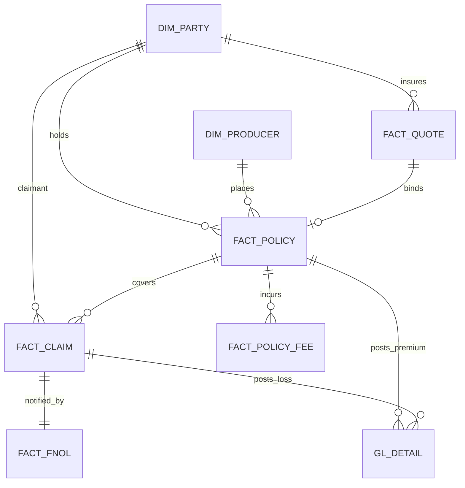

# Architecture & Design Notes

## Design intent

This PoC realises the CFO Data Architecture as a **governed medallion lakehouse with a
hub-and-spoke data mesh**. The medallion (Bronze → Silver → Gold) provides the refinement
pipeline; the mesh provides **domain ownership** — Underwriting, Policy and Claims each own
a curated data product that conforms to shared master data published by the HUB. Finance
consumes all three through the EFR general ledger, and Unity Catalog governs the lot.

### Why hub-and-spoke (not one monolithic warehouse)

- **Conformed keys, distributed ownership.** The HUB publishes `dim_party` / `dim_producer`
  once; every spoke joins to those keys, so premium, losses and exposure reconcile across
  domains without a central team modelling everything.
- **Independent evolution.** A spoke can add tables or change cadence without breaking others,
  as long as it keeps conforming to the hub keys — the data-mesh contract.
- **Blast-radius control.** KYC / PII lives in the HUB and is masked there; spokes reference
  keys, not raw identifiers.

## Zones

| Zone | Schema | Role | Materialisation |
|---|---|---|---|
| Landing (Bronze) | `lz_raw` | Raw, as-landed, immutable + ingestion lineage | Delta tables |
| Organized (Silver) | `oz_organized` | Typed, deduped, conformed, DQ-flagged | Delta tables |
| HUB Primary | `hub` | Golden master data + KYC | Delta tables |
| Spokes | `underwriting`, `policy`, `claims` | Domain data products (facts + summaries) | Delta tables |
| EFR (Gold) | `efr` | General ledger, trial balance, reinsurance | Delta tables |
| Reporting (Gold serving) | `reporting` | CFO reporting marts | Views |

## Data model (key entities)

**HUB** — `dim_party` (party master + KYC rating), `dim_producer` (broker/MGA),
`party_kyc_profile` (KYC status, sanctions, PEP).
**Underwriting** — `fact_quote` (risk score, tech price, price adequacy, hit indicator),
`risk_appetite_summary`.
**Policy** — `fact_policy` (GWP, net premium, in-force), `fact_policy_fee`, `premium_summary`.
**Claims** — `fact_claim` (incurred/paid/reserve, fraud score, severity band),
`fraud_triage`.
**EFR** — `gl_detail` (posting lines), `trial_balance`, `reinsurance_ceded`.

## Finance Engine → GL posting rules

`08_efr_semantic_gold` posts spoke facts into a general ledger (the FDM/AED/EBS/HFM
"Finance Engine"):

| Economic event | Source | Account | Category |
|---|---|---|---|
| Gross written premium | `policy.fact_policy` | 4000 Gross Written Premium | REVENUE |
| Broker commission | `policy.fact_policy_fee` | 6100 Broker Commission | EXPENSE |
| Taxes & fees | `policy.fact_policy_fee` | 6200 Taxes & Fees | EXPENSE |
| Losses paid | `claims.fact_claim` | 5000 Losses Paid | LOSS |
| Loss reserves | `claims.fact_claim` | 5100 Loss Reserves | RESERVE |

`finance_reporting` then derives **loss ratio**, **expense ratio** and **combined ratio**
per LOB / region / period from the trial balance.

## Governance (Unity Catalog, every layer)

- **PII masking** — `mask_pii` / `mask_pii_date` on `dim_party.{tax_id,email,phone,date_of_birth}`;
  unmasked only for `cfo_pii_readers`.
- **KYC masking** — `mask_kyc` on `party_kyc_profile.tax_id`; unmasked only for `cfo_kyc_readers`.
- **Classification tags** — `pii=true` / `kyc=true` on sensitive columns for discovery & audit.
- **Access grants** — reporting readable by `account users`; hub restricted to reader groups.
- **Lineage** — captured automatically by Unity Catalog across the notebook DAG; the bronze
  layer also stamps `_source_file`, `_ingested_at`, `_bronze_batch`.

## Extending the PoC

- Swap synthetic generation (`01`) for **Lakeflow Connect** / Auto Loader on the real
  Genius / Guidewire / Anaplan extracts — the Volume landing pattern is already in place.
- Add a **Genie space** over `reporting.*` for natural-language CFO queries.
- Promote reporting views to **materialized views** or a **Lakeview dashboard** per report area.
- Add **row-level security** (e.g. region-based) alongside the existing column masks.
